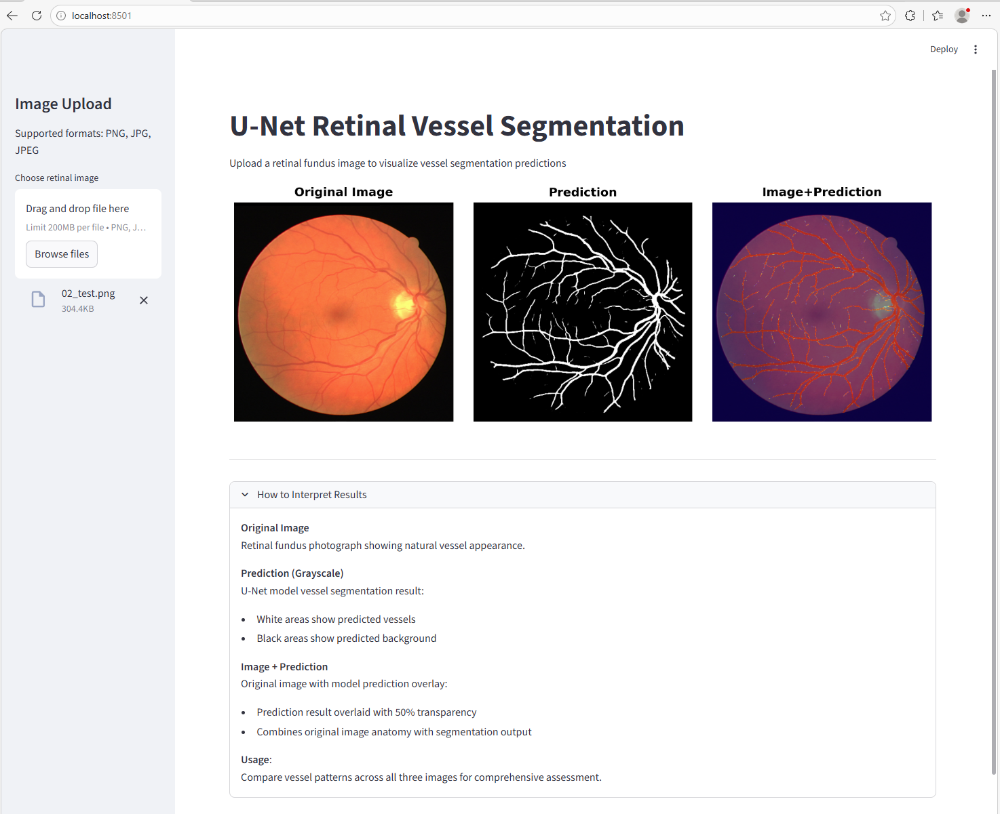

# U-Net Retinal Vessel Segmentation

Complete deep learning pipeline for retinal vessel segmentation using the **DRIVE dataset**.

[](https://www.python.org/)
[](https://pytorch.org/)
[](https://streamlit.io/)

## Overview

`Retinal-vessel-segmentation` is a retinal vessel segmentation project built upon a **U‑Net architecture**. It employs the **DRIVE dataset** for model training and evaluation. Implemented with **PyTorch**, the project provides a complete end‑to‑end workflow, including data preprocessing, model training, and performance assessment.

Additionally, a **Streamlit‑based web application** is developed, allowing users to upload retinal images and instantly obtain corresponding vessel segmentation results. This feature makes the model more accessible for interactive analysis and practical demonstrations in medical imaging research.

## Model Architecture
```
Input (512×512×3)
↓
[Encoder: 64→128→256→512] + MaxPool
↓
Bottleneck: 1024 channels
↓
[Decoder: 512→256→128→64] + Skip Connections
↓
Output: 512×512×1 (logits)
```
Loss Function: **Pure Dice Loss**

```
dice = (2 × |P∩G|) / (|P| + |G|) + smooth
```
## Requirements
```
torch>=2.0.0
torchvision
albumentations>=1.3.0
opencv-python>=4.8.0
streamlit>=1.28.0
matplotlib>=3.7.0
pandas>=2.0.0
tqdm
pillow
numpy
```

## Performance Benchmarks
Evaluation on the DRIVE test set (10 images):

- Mean Dice coefficient: 0.7732 ± 0.0261

- Best Dice score: 0.8064

- Worst Dice score: 0.7147

These results indicate reasonable segmentation accuracy within the state‑of‑the‑art range for deep learning–based retinal vessel segmentation on the DRIVE dataset.

### Key Features:

- Complete preprocessing with configurable data augmentation

- Pure Dice Loss optimized for imbalanced vessel segmentation

- Interactive Streamlit web demo

- Automatic model checkpointing


## Quick Start

### 1. Download DRIVE Dataset
Download the DRIVE dataset and extract it to ./DRIVE/:

```
DRIVE/
├── training/images/       (20 images)
├── training/1st_manual/   (20 masks) 
└── test/images/          (30 images)
└── test/1st_manual/      (30 masks)
```
### 2. Run Complete Pipeline

#### Step 1: Preprocess (4x augmentation)
```
python drive_dataset_preprocessor.py --input ./DRIVE --output ./processed_data --augmentations 4 --resize 512 512
```
#### Step 2: Train model 
```
python train.py
```
- Output Files

| File                         | Purpose                 |
| ---------------------------- | ----------------------- |
| files/unet_checkpoint.pth    | Best model (auto-saved) |
| files/training_history.csv   | Loss tracking           |
| files/loss_curves.png        | Training plots          |
| test_results/dice_scores.csv | Per-image evaluation    |
| test_results/test_*.png      | 6-panel visualizations  |
#### Step 3: Test model
```
python test.py
```

#### Step 4: Launch App
```
streamlit run app.py
```

- Features:

    - Upload any retinal image (PNG/JPG)
    - Instant U-Net inference
    - 3-view display: **Original | Prediction | Overlay**

Screenshot of Streamlit app running retinal vessel segmentation demo. 



## License
MIT License